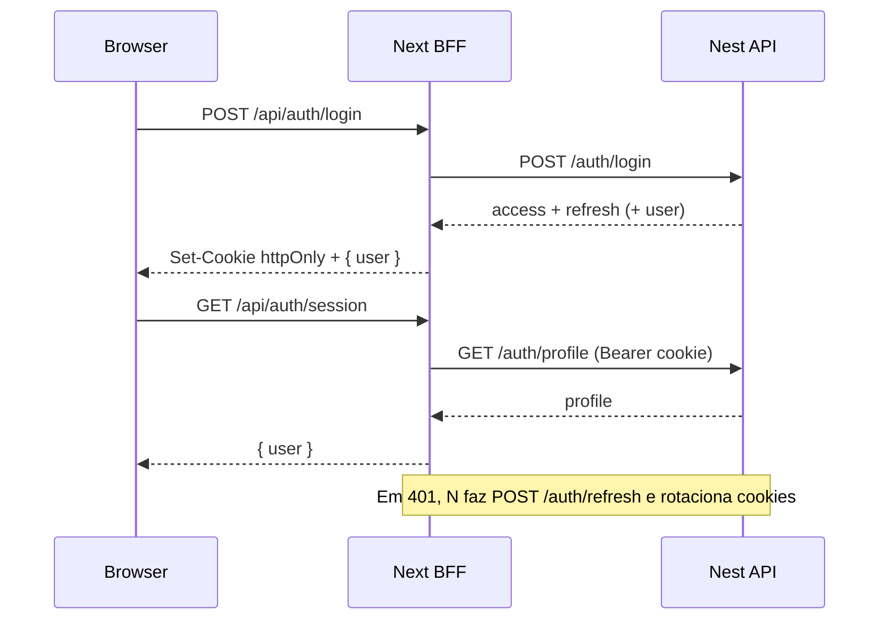

# Arquitetura DDD — Automotive Parts (frontend)

## Visão geral

O App Router (`app/`) orquestra rotas. O Next.js atua como **BFF**: tokens JWT
ficam só em cookies httpOnly do domínio do front. O browser nunca recebe tokens.

```txt
app/
  api/auth/*                 # BFF auth (login/logout/session)
  (auth)/login
  (app)/dashboard
src/
  core/
    http/nest-server-client  # server → Nest (Bearer via cookie + refresh)
  domains/auth/
    domain/
    application/             # use cases do browser → BFF
    infrastructure/
      bff-auth.repository    # fetch /api/auth/*
      server-auth.service    # orquestra Nest + cookies
      cookies/               # httpOnly ap_access_token / ap_refresh_token
    presentation/
  shared/ui/
```

## Fluxo de autenticação (BFF)



## Como chamar a Nest em telas

Use **Server Components / Server Actions / Route Handlers**:

```ts
import { nestServerRequest } from "@/core/http/nest-server-client";

const products = await nestServerRequest<Product[]>("/products");
```

Não chame `API_URL` a partir de Client Components.

## Variáveis de ambiente

```env
API_URL=http://localhost:3031
```

`API_URL` é **server-only** (sem `NEXT_PUBLIC_`).

## Regras de dependência

1. Browser → só `/api/*` do Next (BFF).
2. `domains/*/domain` sem React/Next/fetch.
3. Um domínio não importa internals de outro.

## UI kit

Importar de `@/shared/ui`.
